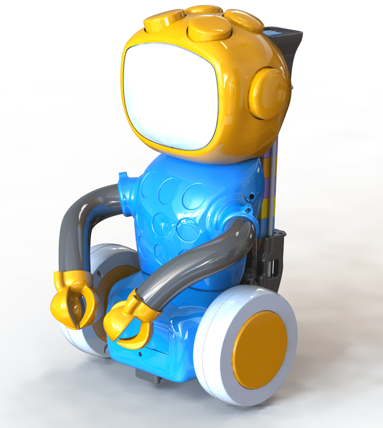
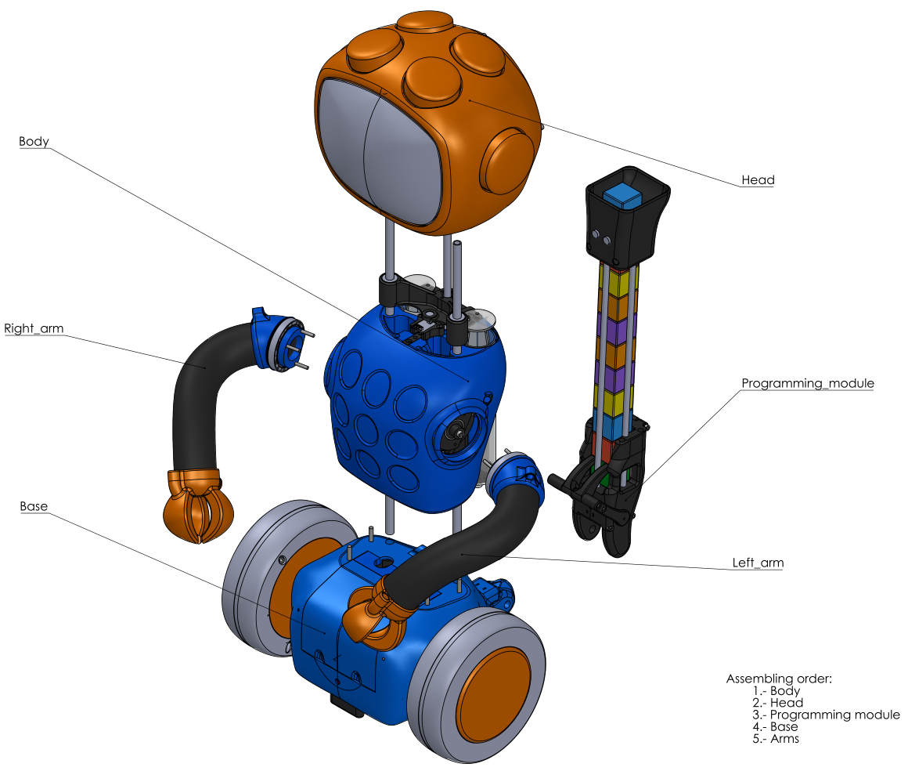

# 3D Design

## Printing process
The list and details of all printable parts in the project can be found on [3D_Parts_list](./3D_Parts_list.pdf) file.

Other considerations:
 - 5 printing configurations are used in the project.
 - All the printings can be done with standard 20 cm cube volume printer.
 - The printing positions are shown in the folder "3D printing positioning captions". 

## Bill of materials
Detailed on the [BOM](./BOM.pdf) and [BOM Screws](./BOM_Screws.pdf) files. 

## Assembly process
The assembly process can be done using the schematic [QuiBot_drawings.pdf](./QuiBot_drawings.PDF) and opening the [Qui-bot.FCStd](./Qui-bot.FCStd) document with FreeCad for further details. 

